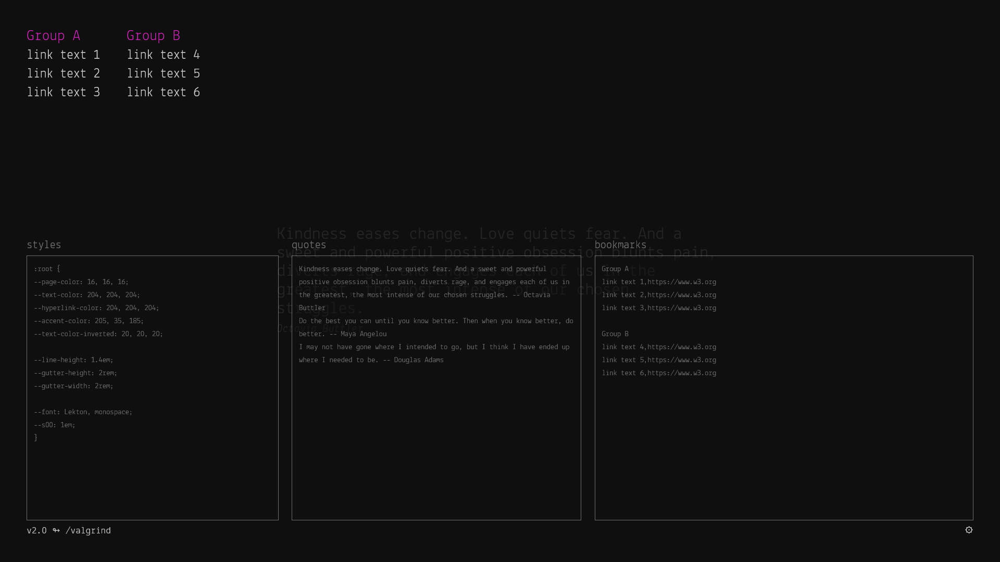

# /valgrind

Valgrind is a local, tracker-free, minimal yet customizable startpage, i.e. you can configure your browser to display it whenever you open a new tab. It will randomly loop through a list of quotes, and display a list of bookmarks when the user’s cursor moves over the top half of the window.

- ⯈ [Live demo](https://rawcdn.githack.com/Arty2/valgrind/master/valgrind.html)
- [Project website](https://heracl.es/valgrind)
- Current version: `2.0`


## Approach

Single page; no external assets; no build systems; functional vanilla JavaScript.

## Etymology

> Valgrind, also known as The Gate of the Dead or The Sacred Gate, is the main entrance to Valhalla.


## Configuration

You may set the [Live demo](https://rawcdn.githack.com/Arty2/valgrind/master/valgrind.html) as your Homepage, or use a plugin such as [Custom New Tab Page](https://addons.mozilla.org/en-US/firefox/addon/custom-new-tab-page/) (Firefox). Click the gear (`⚙`) button, or double click anywhere to open the Settings panel. Your modifications are saved automatically in [localStorage](https://developer.mozilla.org/en-US/docs/Web/API/Window/localStorage). To see your changes, it is necessary to click the Reload (`⭯`) button. Click the gear icon again, or hit the `Esc` key to exit the Settings panel and automatically reload the page. There is currently no way to automatically backup your settings. You can click the Reset (`⭞`) button to return to the initial, default state.

The font used in the screenshot above is [Lekton](https://fonts.google.com/specimen/Lekton) designed at ISIA Urbino, Italy. Specifically the [Lekton Greek](https://www.roleplay.gr/blog/greekifying-lekton-font) version, autohinted by the author.



### Quotes

Each quote should extend to a single line; empty lines are ignored. The [Markdown](https://heracl.es/markdown) notation (`> `)for blockquotes is also ignored. A double dash between spaces (` -- `) can be used to indicate the author’s name. Click on the current quote to randomly display another. Example:

```
Do the best you can until you know better. Then when you know better, do better. -- Maya Angelou
I may not have gone where I intended to go, but I think I have ended up where I needed to be. -- Douglas Adams
```

### Bookmarks

Each bookmark should extent to a single line; empty lines are ignored. Link text should not contain comma (`,`) characters. Unsafe HTML characters are automatically escaped. Example:

```
Group A
link text 1,https://www.w3.org
link text 2,https://www.w3.org
link text 3,https://www.w3.org

Group B
link text 4,https://www.w3.org
link text 5,https://www.w3.org
link text 6,https://www.w3.org
```

### Styles

The Settings panel allows the user to style everything on the page using [CSS](https://developer.mozilla.org/en-US/docs/Learn/CSS/First_steps/What_is_CSS). The defaults expose some “variables” to easily edit RGB values of colors, or the fonts. The following color-schemes can be easily with a simple copy & paste.

#### Default (dark)

```css
:root {
	--page-color: 16, 16, 16;
	--text-color: 204, 204, 204;
	--hyperlink-color: 204, 204, 204;
	--accent-color: 205, 35, 185;
	--text-color-inverted: 20, 20, 20;

	--line-height: 1.4em;
	--gutter-height: 2rem;
	--gutter-width: 2rem;

	--font: Lekton, monospace;
	--s00: 1em;
}
```

#### Onion light

```css
:root {
	--page-color: 221, 238, 255;
	--text-color: 34, 34, 50;
	--hyperlink-color: 34, 34, 50;
	--accent-color: 0, 0, 255;
	--text-color-inverted: 255, 255, 255;
}
```

#### Onion dark

```css
:root {
	--page-color: 34, 34, 34;
	--text-color: 204, 204, 204;
	--hyperlink-color: 204, 204, 204;
	--accent-color: 205, 35, 185;
	--text-color-inverted: 20, 20, 20;
}
```

#### Peach light

```css
:root {
	--page-color: 255, 210, 230;
	--text-color: 0, 0, 0;
	--hyperlink-color: 0, 0, 0;
	--accent-color: 0, 0, 255;
	--text-color-inverted: 255, 255, 255;
}
```

#### Peach dark

```css
:root {
	--page-color: 20, 20, 20;
	--text-color: 255, 210, 230;
	--hyperlink-color: 255, 210, 230;
	--accent-color: 248, 128, 120;
	--text-color-inverted: 20, 20, 20;
}
```

#### DEBTRON light

```css
:root {
	--page-color: 227, 222, 219;
	--text-color: 43, 0, 0;
	--hyperlink-color: 43, 0, 0;
	--accent-color: 189, 30, 46;
	--text-color-inverted: 189, 159, 92;
}
```

#### DEBTRON dark

```css
:root {
	--page-color: 43, 0, 0;
	--text-color: 189, 159, 92;
	--hyperlink-color: 189, 159, 92;
	--accent-color: 189, 30, 46;
	--text-color-inverted: 0, 0, 0;
}
```

#### Grey

```css
:root {
	--page-color: 204, 204, 204;
	--text-color: 0, 0, 0;
	--hyperlink-color: 0, 0, 0;
	--accent-color: 0, 0, 255;
	--text-color-inverted: 200, 200, 200;
}
```

#### Blue

```css
:root {
	--page-color: 0, 0, 255;
	--text-color: 255, 255, 255;
	--hyperlink-color: 255, 255, 255;
	--accent-color: 255, 0, 0;
	--text-color-inverted: 0, 0, 255;
}
```

* * *

© 2021 [Heracles Papatheodorou](https://heracl.es) a.k.a [@Arty2](https://www.twitter.com/Arty2), MIT Licence